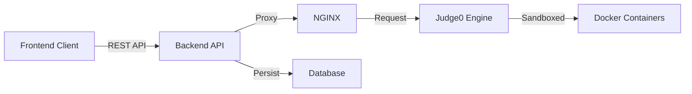

# 🚀 Competitive Coding Platform & Code Execution System

A full-fledged competitive coding platform designed for **Prajyuktam 2025’s Competitive Coding 2.1 event**. This system allows users to write, run, and test code in **70+ programming languages** with a fully custom, scalable backend powered by Judge0, AWS Linux, Docker, and NGINX.

## 📌 Project Overview

This platform enables students to solve coding problems directly in the browser with real-time code execution. It was built to support high-concurrency, low-latency, and secure execution of user-submitted programs.

> **Why a custom backend?**
> Due to the rate limits, token restrictions, and slow responses of public code-execution APIs, a custom self-hosted **Judge0 API** was deployed on AWS to allow unrestricted, high-speed execution during the event.

---

## 🎥 Demo & Live Links

- **📺 Execution Demo:** [Watch on YouTube](https://www.youtube.com/watch?v=mRbdIkk3ur4)
- **🔗 Supported Languages:** [Live Judge0 Instance](https://compilerjudge.shidharthlaishram101.online/languages)

---

## ⭐ Features

### 👨‍💻 User Features

- **Multi-Language Support:** Write, run, and test code in 70+ programming languages.
- **Real-Time Output:** Instant compilation and execution results.
- **Progress Tracking:** Save and resume submissions.
- **Problem Interface:** View problem statements, examples, constraints, and starter code.

### 🛠️ Admin Features

- **Question Management:** Add, edit, and delete coding questions.
- **Test Cases:** Provide sample test cases and hidden evaluation cases.
- **Evaluation:** View user submissions and scores.
- **Plagiarism Detection:** Check for cheating via code similarity and timestamp analysis.

### ⚙️ Backend Capabilities

- **High Availability:** AWS-hosted Judge0 server handling continuous requests.
- **Sandboxed Execution:** Dockerized environment ensures secure compilation and execution.
- **Security:** NGINX reverse proxy with CERTBOT (Let’s Encrypt) for HTTPS.
- **Reliability:** Automated logging, monitoring, and fail-safe mechanisms.
- **Performance:** Caching of language lists and system health status.

---

## 🧱 System Architecture

The data flow ensures security and speed by isolating the execution engine from the application logic.

### Core Components

- **Frontend:** Coding interface with editor & execution pipeline.
- **Backend:** Manages requests, databse and authentication.
- **Judge0 Engine:** Executes user code in isolated containers.
- **AWS ECS:** Linux server hosting the execution engine.
- **NGINX + CERTBOT:** Secure reverse proxy for HTTPS.

---

## 🧰 Tech Stack

| Domain | Technologies |
| :--- | :--- |
| **Frontend** | HTML, CSS, JavaScript, CodeMirror/Monaco Editor |
| **Backend** | Node.js, Express.js, Judge0 API Wrapper |
| **Database** | MySQL / PostgreSQL |
| **Infrastructure** | AWS EC2 (Ubuntu), Docker, Docker Compose |
| **DevOps** | NGINX Reverse Proxy, Certbot (SSL) |

---

## 🏆 Event History

This system successfully powered the Competitive Coding 2.1 event during Prajyuktam 2025, enabling seamless execution for hundreds of participants without downtime.

### 🙌 Acknowledgements

- **Judge0 Team** for their incredible open-source execution engine.

### 🪪 License

This project is licensed under the MIT License
