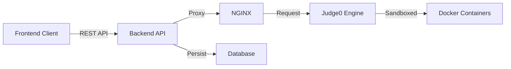

# 🚀 Competitive Coding Platform & Code Execution System


A full-fledged competitive coding platform designed for **Prajyuktam 2025’s Competitive Coding 2.1 event**. This system allows users to write, run, and test code in **70+ programming languages** with a fully custom, scalable backend powered by Judge0, AWS Linux, Docker, and NGINX.

## 📌 Project Overview

This platform enables students to solve coding problems directly in the browser with real-time code execution. It was built to support high-concurrency, low-latency, and secure execution of user-submitted programs.

> **Why a custom backend?**
> Due to the rate limits, token restrictions, and slow responses of public code-execution APIs, a custom self-hosted **Judge0 API** was deployed on AWS to allow unrestricted, high-speed execution during the event.

---

## 🎥 Demo & Live Links

- **📺 Execution Demo:** [Watch on YouTube](https://www.youtube.com/watch?v=mRbdIkk3ur4)
- **🔗 Supported Languages:** [Live Judge0 Instance](https://compilerjudge.shidharthlaishram101.online/languages)

---

## ⭐ Features

### 👨‍💻 User Features

- **Multi-Language Support:** Write, run, and test code in 70+ programming languages.
- **Real-Time Output:** Instant compilation and execution results.
- **Progress Tracking:** Save and resume submissions.
- **Problem Interface:** View problem statements, examples, constraints, and starter code.

### 🛠️ Admin Features

- **Question Management:** Add, edit, and delete coding questions.
- **Test Cases:** Provide sample test cases and hidden evaluation cases.
- **Evaluation:** View user submissions and scores.
- **Plagiarism Detection:** Check for cheating via code similarity and timestamp analysis.

### ⚙️ Backend Capabilities

- **High Availability:** AWS-hosted Judge0 server handling continuous requests.
- **Sandboxed Execution:** Dockerized environment ensures secure compilation and execution.
- **Security:** NGINX reverse proxy with CERTBOT (Let’s Encrypt) for HTTPS.
- **Reliability:** Automated logging, monitoring, and fail-safe mechanisms.
- **Performance:** Caching of language lists and system health status.

---

## 🧱 System Architecture

The data flow ensures security and speed by isolating the execution engine from the application logic.



### Core Components

- **Frontend:** Coding interface with editor & execution pipeline.
- **Backend:** Manages requests, databse and authentication.
- **Judge0 Engine:** Executes user code in isolated containers.
- **AWS ECS:** Linux server hosting the execution engine.
- **NGINX + CERTBOT:** Secure reverse proxy for HTTPS.

---

## 🧰 Tech Stack

| Domain | Technologies |
| :--- | :--- |
| **Frontend** | HTML, CSS, JavaScript, CodeMirror/Monaco Editor |
| **Backend** | Node.js, Express.js, Judge0 API Wrapper |
| **Database** | MySQL / PostgreSQL |
| **Infrastructure** | AWS EC2 (Ubuntu), Docker, Docker Compose |
| **DevOps** | NGINX Reverse Proxy, Certbot (SSL) |

---

## 🏆 Event History

This system successfully powered the Competitive Coding 2.1 event during Prajyuktam 2025, enabling seamless execution for hundreds of participants without downtime.

## Judge0 Self-Hosted API Setup Guide

This guide explains how to set up Judge0 Self-Hosted API for code compilation in this project.

## Overview

Judge0 Self-Hosted API is used for online code compilation and execution. The project supports three languages:

- **Python 3** (Language ID: 92)
- **C** (Language ID: 50)
- **Java** (Language ID: 62)

## Prerequisites

1. A self-hosted Judge0 API instance (deployed on AWS EC2 or similar)
2. The API should be accessible via HTTPS with SSL certificate
3. The API should support the standard Judge0 API endpoints

## Configuration

### Environment Variables

#### For Local Development

1. Create a `.env` file in the project root (if it doesn't exist)
2. Add the following environment variables:

```env
JUDGE0_API_URL=https://api.shidharthlaishram101.online
```

**Optional:** If your Judge0 API requires authentication, add:

```env
JUDGE0_AUTH_HEADER=Bearer your-token-here
JUDGE0_AUTH_HEADER_NAME=Authorization
```

**Notes:**

- `JUDGE0_API_URL` defaults to `https://api.shidharthlaishram101.online` if not provided
- `JUDGE0_AUTH_HEADER` is optional - only needed if your API requires authentication
- `JUDGE0_AUTH_HEADER_NAME` defaults to `Authorization` if not provided

#### For Vercel Deployment

1. Go to your Vercel project dashboard
2. Navigate to: **Settings → Environment Variables**
3. Add the following environment variables:
   - **Name**: `JUDGE0_API_URL`
   - **Value**: `https://api.shidharthlaishram101.online`
   - **Environments**: Select all (Production, Preview, Development)

   - **Name**: `JUDGE0_AUTH_HEADER` (Optional - only if authentication is required)
   - **Value**: Your authentication token
   - **Environments**: Select all (Production, Preview, Development)

   - **Name**: `JUDGE0_AUTH_HEADER_NAME` (Optional)
   - **Value**: `Authorization` (or your custom header name)
   - **Environments**: Select all (Production, Preview, Development)

4. **Important:** After setting environment variables, redeploy your project:
   - Go to **Deployments** tab
   - Click **"Redeploy"** on the latest deployment
   - Or trigger a new deployment by pushing to your Git repository

## API Endpoint

The backend exposes a POST endpoint at `/api/execute` that accepts:

```json
{
  "code": "print('Hello, World!')",
  "language": "python",
  "stdin": ""
}
```

**Supported languages:**

- `python` - Python 3
- `c` - C (GCC)
- `java` - Java

**Response format:**

```json
{
  "stdout": "Hello, World!\n",
  "stderr": "",
  "compile_output": "",
  "message": "",
  "status": {
    "id": 3,
    "description": "Accepted"
  },
  "time": "0.01",
  "memory": 1024
}
```

## How It Works

1. **Submission Creation**: The backend creates a submission on the Judge0 API
2. **Polling**: The backend polls the Judge0 API every second to check the status
3. **Completion**: Once the submission is complete (status.id > 2), the result is returned
4. **Timeout**: The polling will timeout after 30 attempts (30 seconds)

## Concurrent Requests

The implementation supports concurrent requests from multiple users (10-20 users):

- Each request is handled independently
- The backend uses async/await for non-blocking operations
- Express.js handles multiple concurrent requests efficiently
- The Judge0 API should be configured to handle multiple simultaneous submissions

## Testing the Setup

### Local Testing

1. Make sure your `.env` file is set up correctly
2. Start the server:

   ```bash
   npm start
   ```

3. Navigate to `http://localhost:8080/contest`
4. Try running a simple code:
   - Select Python 3
   - Enter: `print("Hello, World!")`
   - Click "Run Code"
   - You should see the output in the output panel

### Test with Different Languages

**Python:**

```python
print("Hello from Python!")
```

**C:**

```c
#include <stdio.h>
int main() {
    printf("Hello from C!\n");
    return 0;
}
```

**Java:**

```java
public class Main {
    public static void main(String[] args) {
        System.out.println("Hello from Java!");
    }
}
```

## Troubleshooting

### Error: "Judge0 API error: 500"

- Check that your Judge0 API is running and accessible
- Verify the API URL is correct
- Check the Judge0 API logs for errors
- Ensure the API has proper SSL certificate configuration

### Error: "Failed to get submission token from Judge0"

- Verify the Judge0 API is responding correctly
- Check that the `/submissions` endpoint is available
- Verify the request format matches Judge0 API requirements

### Connection Timeout Errors

If you're experiencing connection timeout errors:

1. **Check your internet connection** - Ensure you have a stable internet connection
2. **Verify API endpoint** - Make sure `JUDGE0_API_URL` is correct and accessible
3. **Check firewall/proxy** - Ensure your network allows connections to the Judge0 API
4. **Check AWS Security Groups** - Ensure your EC2 instance security group allows incoming connections
5. **Verify SSL Certificate** - Ensure your SSL certificate is valid and properly configured

### Code execution timeout

- The default CPU time limit is 2 seconds
- The polling timeout is 30 seconds
- For longer-running code, you may need to adjust the `cpu_time_limit` in `app.js`
- You can also increase `maxAttempts` in the polling loop for longer execution times

### Authentication Issues

If your Judge0 API requires authentication:

1. Set the `JUDGE0_AUTH_HEADER` environment variable
2. Set the `JUDGE0_AUTH_HEADER_NAME` if using a custom header name
3. Verify the authentication token is valid
4. Check the Judge0 API documentation for the correct authentication method

### Network errors

- Check your internet connection
- Verify the Judge0 API endpoint is accessible from your server
- Check server logs for detailed error messages
- Verify CORS settings if accessing from a browser

## Performance Considerations

### For 10-20 Concurrent Users

1. **Judge0 API Capacity**: Ensure your Judge0 API instance can handle 10-20 concurrent submissions
2. **EC2 Instance Size**: Use an appropriate EC2 instance size (t3.medium or larger recommended)
3. **Database**: If using a database for submissions, ensure it can handle concurrent writes
4. **Polling Interval**: The current polling interval is 1 second, which should be sufficient
5. **Timeout Settings**: Adjust timeout settings based on your typical code execution times

## Security Notes

- **Never commit your `.env` file to Git**
- The `.env` file should be in `.gitignore`
- Keep your API authentication tokens secure
- Use HTTPS for all API communications
- Implement rate limiting if needed to prevent abuse
- Monitor API usage and set up alerts for unusual activity

## Judge0 API Status Codes

The Judge0 API uses the following status IDs:

- `1` - In Queue
- `2` - Processing
- `3` - Accepted (Success)
- `4` - Wrong Answer
- `5` - Time Limit Exceeded
- `6` - Compilation Error
- `7` - Runtime Error (SIGSEGV)
- `8` - Runtime Error (SIGXFSZ)
- `9` - Runtime Error (SIGFPE)
- `10` - Runtime Error (SIGABRT)
- `11` - Runtime Error (NZEC)
- `12` - Runtime Error (Other)
- `13` - Internal Error
- `14` - Exec Format Error

## Additional Resources

- [Judge0 API Documentation](https://ce.judge0.com/)
- [Judge0 GitHub Repository](https://github.com/judge0/judge0)
- [AWS EC2 Documentation](https://docs.aws.amazon.com/ec2/)
- [Vercel Environment Variables Guide](https://vercel.com/docs/concepts/projects/environment-variables)

### 🙌 Acknowledgements

- **Judge0 Team** for their incredible open-source execution engine.

### 🪪 License

This project is licensed under the MIT License
